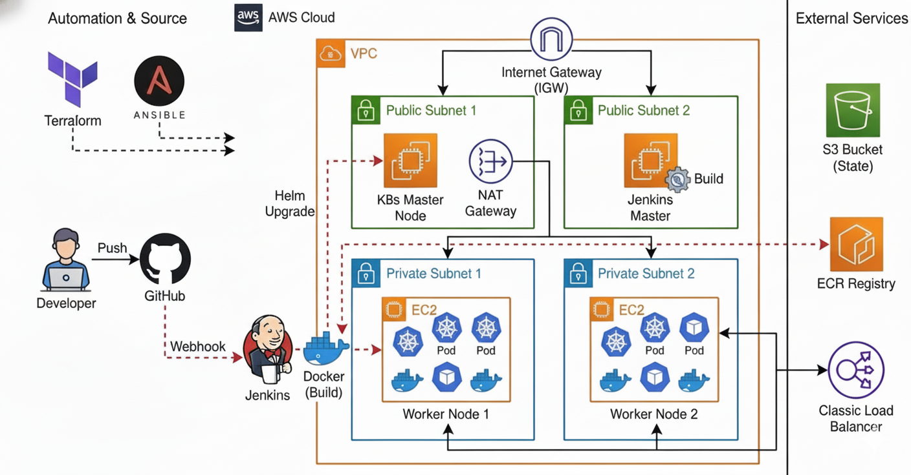
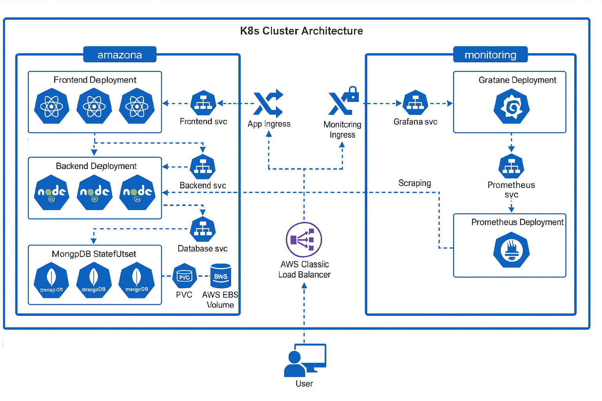

# 🛒 Amazona E-Commerce Platform - DevOps Capstone Project


## 📖 Table of Contents
1.  [Project Overview](#-project-overview)
2.  [Architecture Deep Dive](#-architecture-deep-dive)
3.  [Technology Stack](#-technology-stack)
4.  [Detailed Documentation](#-detailed-documentation)
5.  [Prerequisites](#-prerequisites)
6.  [Installation & Deployment Guide](#-installation--deployment-guide)
7.  [Monitoring & Observability](#-monitoring--observability)
8.  [Fields of Development & Future Enhancements](#-fields-of-development--future-enhancements)
9.  [Troubleshooting](#-troubleshooting)
10. [👥 Team Members](#-team-members)

---

## 🌟 Project Overview

**Amazona** is a fully functional, microservices-based e-commerce application designed to demonstrate a complete, end-to-end DevOps lifecycle. This project was built as a Capstone Project to showcase mastery over modern cloud-native technologies, infrastructure automation, and container orchestration.

The application consists of a **React Frontend**, a **Node.js Backend**, and a **MongoDB Database**, all containerized and deployed on a custom-built Kubernetes cluster on AWS.

### Key Features
*   **High Availability**: Deployed across multiple Availability Zones (AZs) to ensure fault tolerance.
*   **Scalability**: Kubernetes Horizontal Pod Autoscaling (HPA) handles traffic spikes.
*   **Automation**: 100% Infrastructure as Code (IaC) using Terraform and Ansible.
*   **Continuous Delivery**: Automated CI/CD pipelines using Jenkins and Helm.
*   **Observability**: Integrated Monitoring stack with Prometheus and Grafana.

---

## 🏗️ Architecture Deep Dive

This project follows a strict **3-Tier Architecture** deployed within a Virtual Private Cloud (VPC) on AWS.

### Infrastructure Design
The infrastructure is provisioned using **Terraform** and follows security best practices:

*   **VPC**: A custom VPC (10.0.0.0/16) provides network isolation.
*   **Subnets**:
    *   **2 Public Subnets**: Host the **Kubernetes Control Plane**, **Jenkins Master**, and **NAT Gateways**. These have direct internet access via an Internet Gateway (IGW).
    *   **2 Private Subnets**: Host the **Kubernetes Worker Nodes**. These are isolated from the internet and only accessible via the NAT Gateway or the Load Balancer.
*   **Networking**: Route tables, Security Groups, and NACLs are configured to strictly control traffic flow.

*Note on Load Balancing: We utilized the **AWS Classic Load Balancer (CLB)** for this deployment to optimize costs and stay within the AWS Free Tier limits.*


*Figure 1: High-Level Infrastructure Overview*

### Kubernetes Cluster
We deployed a self-managed Kubernetes cluster using `kubeadm` rather than using EKS, to demonstrate deep understanding of cluster components.

*   **Control Plane**: Runs `kube-apiserver`, `etcd`, `kube-scheduler`, and `kube-controller-manager`.
*   **Worker Nodes**: Run `kubelet`, `kube-proxy`, and the Container Runtime (Docker/Containerd).
*   **Networking (CNI)**: We use **Calico** or **Flannel** for pod-to-pod communication.
*   **Storage (CSI)**: AWS EBS CSI Driver is installed to provision Persistent Volumes (PVs) for MongoDB.


*Figure 2: Kubernetes Cluster Components*

### CI/CD Pipeline
Our Continuous Integration and Continuous Deployment pipeline is powered by **Jenkins**.

1.  **Source**: Developer pushes code to **GitHub**.
2.  **Trigger**: A Webhook triggers the Jenkins Pipeline.
3.  **Build**: Jenkins builds the Docker images for Frontend and Backend.
4.  **Push**: Images are pushed to **AWS Elastic Container Registry (ECR)**.
5.  **Deploy**: Jenkins uses **Helm** to upgrade the release on the Kubernetes cluster.


*Figure 3: CI/CD Pipeline Flow*

---

## 🛠️ Technology Stack

We utilized a modern, industry-standard stack for this project:

### ☁️ Cloud & Infrastructure


### ⚙️ DevOps & Orchestration


### 📊 Monitoring


### 💻 Application


---

## � Detailed Documentation

We have prepared comprehensive documentation for each component of the project. Please refer to these guides for deep dives into specific tools:

| Component | Description | Documentation Link |
| :--- | :--- | :--- |
| **Terraform** | Infrastructure provisioning (VPC, EC2, Security Groups) | [Terraform Docs](docs/TERRAFORM_DOCUMENTATION.md) |
| **Ansible** | Configuration management & K8s bootstrapping | [Ansible Docs](docs/ANSIBLE_DOCUMENTATION.md) |
| **Kubernetes & Helm** | Cluster architecture, Charts, and Manifests | [K8s & Helm Docs](docs/KUBERNETES&&HELM_DOCUMENTATION.md) |
| **CI/CD Pipeline** | Jenkins pipeline stages and Groovy scripts | [Pipeline Docs](docs/PIPELINE_DOCUMETATION.md) |
| **Docker** | Containerization strategy and Dockerfiles | [Docker Docs](docs/DOCKER_DOCUMENTATION.md) |
| **Source Code** | Application codebase structure (React/Node) | [Source Code Docs](docs/SOURCE_CODE_DOCEMENTATION.md) |

---

## �📋 Prerequisites

Before you begin, ensure you have the following installed and configured:

1.  **AWS Account**: With Administrator permissions.
2.  **AWS CLI**: Installed and configured (`aws configure`).
3.  **Terraform**: v1.0+.
4.  **Ansible**: v2.9+.
5.  **Kubectl**: Installed locally.
6.  **SSH Key Pair**: Generated and saved as `my-key.pem`.

---

## 🚀 Installation & Deployment Guide

Follow these steps to deploy the entire project from scratch.

### Step 1: Infrastructure Provisioning (Terraform)
Navigate to the `terraform` directory to create the AWS infrastructure.

```bash
cd terraform

# Initialize Terraform
terraform init

# Plan the changes
terraform plan

# Apply the configuration (Type 'yes' to confirm)
terraform apply --auto-approve
```
*Output: This will output the Public IPs of the Master Node and Jenkins Server.*

### Step 2: Configuration Management (Ansible)
Once the infrastructure is ready, use Ansible to configure the servers.

```bash
cd ../ansible

# Update inventory file with new IPs
# (Assuming dynamic inventory or manual update)

# Run the main playbook
ansible-playbook -i inventory/hosts.ini site.yml
```
*Action: This installs Docker, Kubeadm, initializes the cluster, and joins worker nodes.*

### Step 3: Application Deployment (Helm)
Now deploy the application using Helm.

```bash
cd ../

# Install the Amazona Chart
helm install amazona ./k8s-charts --namespace amazona --create-namespace

# Verify Pods
kubectl get pods -n amazona
```

---

## 📊 Monitoring & Observability

We have implemented a robust monitoring stack:

*   **Prometheus**: Scrapes metrics from the Kubernetes nodes and the Backend application.
*   **Grafana**: Visualizes these metrics on custom dashboards.

**Accessing Monitoring:**
1.  **Grafana**: `http://monitor-amazona.example.com` (via Ingress)
2.  **Prometheus**: `http://prometheus.example.com`

**Metrics Collected:**
*   Node CPU/Memory Usage.
*   Pod Restart Counts.
*   API Request Latency.
*   MongoDB Connection Status.

---

## 🚀 Fields of Development & Future Enhancements

We have identified several key areas for future development to further harden and scale the platform.

### 1. High Availability Control Plane (Multi-Master)
*   **Current State**: Single Master Node.
*   **Enhancement**: Deploying a **Multi-Master Control Plane** distributed across multiple Availability Zones.
*   **Network Upgrade**: Implementing an **AWS Network Load Balancer (NLB)** to distribute traffic across the multiple API Servers, ensuring zero downtime even if a master node fails.

### 2. Security Hardening (IAM Instance Profiles)
*   **Current State**: Explicit IAM User Access Keys.
*   **Enhancement**: Migrating to **IAM Instance Profiles**. This allows EC2 instances to assume roles dynamically, eliminating the need for long-term credentials and significantly improving the security posture.

### 3. GitOps Implementation (ArgoCD)
*   **Current State**: Push-based deployment via Jenkins.
*   **Enhancement**: Adopting **ArgoCD** for a Pull-based GitOps workflow. This ensures the cluster state is always synchronized with the Git repository and provides better visibility into configuration drift.

### 4. Advanced Load Balancing (ALB)
*   **Current State**: Classic Load Balancer (CLB) for cost optimization.
*   **Enhancement**: Upgrading to the **AWS Load Balancer Controller** to provision Application Load Balancers (ALB). This unlocks advanced Layer 7 routing capabilities, WAF integration, and path-based routing.

---

## 🔧 Troubleshooting

*   **Jenkins Build Fails**: Check if the ECR repository exists and the Jenkins user has `AmazonEC2ContainerRegistryFullAccess`.
*   **Pods Pending**: Check if the PVC is bound. If using EBS, ensure the CSI driver is installed and the Node IAM Role has `AmazonEBSCSIDriverPolicy`.
*   **Ingress 404**: Ensure the Ingress Controller is running and the DNS points to the Load Balancer.

---

## 👥 Team Members

This project was made possible by the hard work and collaboration of the following team members:

*   **Abdelhameed Nael** 
*   **Ahmed Osama** 
*   **Mohamed Osama** 
*   **Arwa Elsawy** 
*   **Shimaa Mohamed** 

---
*© 2025 Depi Final Project. All Rights Reserved.*

