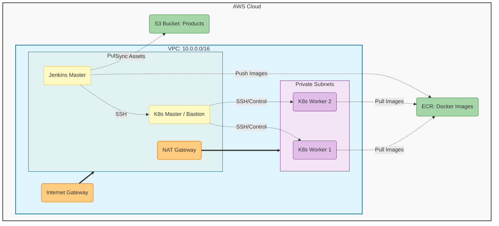

# Terraform System Documentation

**Project:** Depi Final Project Infrastructure  
**Version:** 1.3  
**Last Updated:** 2025-11-29

## 1. System Overview

This documentation describes the Terraform Infrastructure as Code (IaC) suite designed to provision the underlying AWS infrastructure for the project. It manages the lifecycle of networking, compute, storage, and security resources required for the Jenkins and Kubernetes environments.

### 1.1. Architecture
The infrastructure is modularized into the following components:

*   **Network**: VPC, Subnets (Public/Private), Internet Gateway, NAT Gateway, and Route Tables.
*   **Security Groups**: Firewall rules for Jenkins, Kubernetes Masters, and Workers.
*   **Compute**: EC2 instances for Jenkins Master, Kubernetes Master (Bastion), and Kubernetes Workers.
*   **Storage**: S3 buckets for product data.
*   **Registry**: ECR repositories for container images.

### 1.2. Architecture Diagram



## 2. Directory Hierarchy

The following tree represents the exact structure of the `terraform/` directory.

```text
terraform/
├── main.tf                     # Root configuration (Module orchestration)
├── variables.tf                # Input variable declarations
├── outputs.tf                  # Output definitions
├── ansible_inventory.tf        # Ansible inventory generation resource
├── ansible_inventory.tpl       # Template for hosts.ini
├── modules/                    # Reusable infrastructure modules
│   ├── network/                # VPC and Subnet configuration
│   │   ├── main.tf
│   │   ├── outputs.tf
│   │   └── variables.tf
│   ├── security_groups/        # Security Group rules
│   │   ├── main.tf
│   │   ├── outputs.tf
│   │   └── variables.tf
│   ├── compute/                # EC2 Instance provisioning
│   │   ├── main.tf
│   │   ├── outputs.tf
│   │   └── variables.tf
│   ├── s3/                     # S3 Bucket creation
│   │   ├── main.tf
│   │   ├── outputs.tf
│   │   └── variables.tf
│   └── ecr/                    # ECR Repository creation
│       ├── main.tf
│       ├── outputs.tf
│       └── variables.tf
```

## 3. Configuration Reference

This section details the configuration of the root module and its sub-modules.

### 3.1. Root Configuration (`main.tf`)
The root module orchestrates the deployment by calling sub-modules in a specific order. It configures the AWS provider using the `aws_region` variable.

### 3.2. Input Variables (`variables.tf`)
Key variables controlling the deployment:

| Variable                     | Default                | Description                          |
| :--------------------------- | :--------------------- | :----------------------------------- |
| `aws_region`                 | `us-east-1`            | Target AWS Region.                   |
| `vpc_cidr`                   | `10.0.0.0/16`          | CIDR block for the VPC.              |
| `k8s_master_instance_type`   | `c7i-flex.large`       | Instance type for K8s Master.        |
| `k8s_worker_instance_type`   | `t3.small`             | Instance type for K8s Workers.       |
| `k8s_worker_count`           | `2`                    | Number of worker nodes to provision. |
| `ssh_key_name`               | `k8s-key`              | AWS Key Pair name for SSH access.    |
| `products_bucket_name`       | `depi-products-bucket` | Name of the S3 bucket.               |

## 4. Deep Dive: Module Specifications

This section provides granular technical details for each module.

### 4.1. Network Module (`modules/network`)
**VPC Configuration**:
*   **CIDR**: `10.0.0.0/16` (Default)
*   **DNS Support**: Enabled

**Subnet Mapping**:

| Subnet Name                 | CIDR          | Type    | Availability Zone | Purpose                     |
| :-------------------------- | :------------ | :------ | :---------------- | :-------------------------- |
| `k8s_public_subnet`         | `10.0.1.0/24` | Public  | `us-east-1a`      | Kubernetes Master (Bastion) |
| `jenkins_public_subnet`     | `10.0.2.0/24` | Public  | `us-east-1b`      | Jenkins Master              |
| `k8s_private_app_subnet1`   | `10.0.3.0/24` | Private | `us-east-1b`      | Kubernetes Workers          |
| `k8s_private_app_subnet2`   | `10.0.4.0/24` | Private | `us-east-1a`      | Kubernetes Workers          |

**Routing**:
*   **Public Route Table**: Routes `0.0.0.0/0` -> Internet Gateway (`igw`).
*   **Private Route Table**: Routes `0.0.0.0/0` -> NAT Gateway (`nat_gw`).
*   **NAT Gateway**: Deployed in `k8s_public_subnet` with an Elastic IP (`nat_eip`).

### 4.2. Security Groups Module (`modules/security_groups`)
**Rules Matrix**:

**1. Kubernetes Master (`k8s-master-sg`)**

| Type    | Protocol | Port | Source          | Description              |
| :------ | :------- | :--- | :-------------- | :----------------------- |
| Ingress | TCP      | 22   | `0.0.0.0/0`     | SSH Access               |
| Ingress | TCP      | 6443 | `0.0.0.0/0`     | Kubernetes API Server    |
| Ingress | All      | All  | `k8s-worker-sg` | All traffic from Workers |
| Ingress | TCP      | 8080 | `0.0.0.0/0`     | Jenkins Integration      |
| Egress  | All      | All  | `0.0.0.0/0`     | Allow all outbound       |

**2. Kubernetes Worker (`k8s-worker-sg`)**

| Type    | Protocol | Port        | Source              | Description                 |
| :------ | :------- | :---------- | :------------------ | :-------------------------- |
| Ingress | All      | All         | `k8s-master-sg`     | Control Plane Communication |
| Ingress | All      | All         | Self                | Pod-to-Pod Communication    |
| Ingress | TCP      | 30000-32767 | `0.0.0.0/0`         | NodePort Services           |
| Ingress | TCP      | 22          | `jenkins-master-sg` | SSH from Jenkins            |
| Egress  | All      | All         | `0.0.0.0/0`         | Allow all outbound          |

**3. Jenkins Master (`jenkins-master-sg`)**

| Type    | Protocol | Port  | Source      | Description        |
| :------ | :------- | :---- | :---------- | :----------------- |
| Ingress | TCP      | 22    | `0.0.0.0/0` | SSH Access         |
| Ingress | TCP      | 8080  | `0.0.0.0/0` | Jenkins UI         |
| Ingress | TCP      | 50000 | `0.0.0.0/0` | Agent JNLP         |
| Ingress | TCP      | 6443  | `0.0.0.0/0` | K8s API Access     |
| Egress  | All      | All   | `0.0.0.0/0` | Allow all outbound |

### 4.3. Compute Module (`modules/compute`)
**Instance Configuration**:
*   **AMI**: `ami-0cae6d6fe6048ca2c` (Hardcoded Ubuntu AMI)
*   **Key Pair**: `k8s-key` (Must exist in AWS)

**IAM Roles & Policies**:
*   **Master Role** (`k8s_master_role`):
    *   `AmazonEBSCSIDriverPolicy`
    *   `AWSLoadBalancerControllerIAMPolicy` (Custom)
    *   `AmazonEC2FullAccess`
    *   `AmazonEC2ContainerRegistryPowerUser`
    *   `AmazonS3FullAccess`
    *   `AmazonSSMReadOnlyAccess`
*   **Worker Role** (`k8s_worker_role`):
    *   `AmazonEC2ContainerRegistryPowerUser`
    *   `AWSLoadBalancerControllerIAMPolicy`
    *   `AmazonEBSCSIDriverPolicy`
    *   `AmazonEC2FullAccess`
    *   `AmazonSSMReadOnlyAccess`
*   **Jenkins Role** (`jenkins-master-role`):
    *   `AmazonEBSCSIDriverPolicy`
    *   `AmazonEC2ContainerRegistryPowerUser`
    *   `AmazonS3FullAccess`
    *   `AmazonSSMReadOnlyAccess`

**Metadata Options**:
*   HTTP Endpoint: Enabled
*   HTTP Tokens: Optional
*   Hop Limit: 2

### 4.4. Storage & Registry Modules
**S3 (`modules/s3`)**:
*   **Bucket Name**: `depi-products-bucket` (Default)
*   **ACL**: Public Read (Configured via `aws_s3_bucket_acl` and `public_access_block`)
*   **IAM User**: Creates `s3_user` with `AmazonS3FullAccess`.

**ECR (`modules/ecr`)**:
*   **Repositories**: `depi-app-frontend`, `depi-app-backend`
*   **Scanning**: Scan on push enabled.
*   **Mutability**: Mutable tags.

## 5. Deployment Procedure (SOP)

To provision the infrastructure, follow these procedures on the Control Node.

### 5.1. Prerequisites
1.  **Terraform Installed**: Ensure Terraform v1.0+ is installed.
2.  **AWS Credentials**: Configure AWS CLI or set environment variables (`AWS_ACCESS_KEY_ID`, `AWS_SECRET_ACCESS_KEY`).
3.  **SSH Key Pair (Critical)**: You **must** have the specific SSH key pair generated locally.
    *   **Requirement**: Terraform reads the public key from `~/.ssh/DEPI_Project_rsa.pub` to create the AWS Key Pair resource.
    *   **Action**: Ensure this file exists on your Control Node before running Terraform. If you use a different key, update `modules/compute/main.tf`.

### 5.2. Initialization
Initialize the Terraform working directory to download providers and modules.
```bash
cd terraform
terraform init
```

### 5.3. Planning
Generate an execution plan to preview changes.
```bash
terraform plan -out=tfplan
```
*   **Verification**: Review the plan to ensure it creates the expected resources (approx. 25-30 resources).

### 5.4. Application
Apply the changes to provision the infrastructure.
```bash
terraform apply tfplan
```
*   **Note**: This process may take 5-10 minutes, primarily due to NAT Gateway creation.

### 5.5. Post-Deployment Verification
1.  **Outputs**: Verify Terraform outputs the expected IPs and resource IDs.
2.  **Inventory**: Check that `../Ansible/inventory/hosts.ini` has been created and populated with valid IP addresses.
    ```bash
    cat ../Ansible/inventory/hosts.ini
    ```

## 6. Critical Configuration Notes

> [!IMPORTANT]
> **Region Dependency**: The AMI ID (`ami-0cae6d6fe6048ca2c`) in `modules/compute/main.tf` is hardcoded for **us-east-1** (Ubuntu 24.04 LTS).
> *   If you change `var.aws_region`, you **must** update the AMI ID to match the new region.

> [!WARNING]
> **S3 Bucket Uniqueness**: S3 bucket names must be globally unique across all of AWS.
> *   The default name `depi-products-bucket` may already be taken.
> *   **Action**: Update `var.products_bucket_name` in `variables.tf` or `terraform.tfvars` to a unique value (e.g., `depi-products-bucket-<your-name>`).

> [!NOTE]
> **Directory Structure**: The `ansible_inventory` resource expects the directory `../Ansible/inventory/` to exist relative to the Terraform root. Ensure you have cloned the entire repository structure correctly.

## 7. Troubleshooting

### 7.1. State Lock Errors
**Symptom**: `Error acquiring the state lock`.
**Root Cause**: A previous Terraform process crashed or is still running.
**Resolution**:
1.  Ensure no other process is running.
2.  Force unlock (use with caution): `terraform force-unlock <LOCK_ID>`.

### 7.2. Subnet Conflict
**Symptom**: `InvalidSubnet.Conflict`.
**Root Cause**: The requested CIDR block overlaps with an existing subnet in the VPC.
**Resolution**: Update `vpc_cidr` or subnet variables in `variables.tf` to use non-overlapping ranges.

### 7.3. SSH Key Not Found
**Symptom**: `InvalidKeyPair.NotFound`.
**Root Cause**: The key pair specified in `var.ssh_key_name` does not exist in the selected AWS region.
**Resolution**: Create the key pair in AWS Console or update the variable to match an existing key.

### 7.4. Inventory Not Generated
**Symptom**: `hosts.ini` file is missing or empty.
**Root Cause**: Terraform apply failed, or the `local_file` resource failed to write permissions.
**Resolution**:
1.  Check `terraform apply` logs for errors.
2.  Verify write permissions on the `../Ansible/inventory/` directory.
3.  Re-run `terraform apply`.
